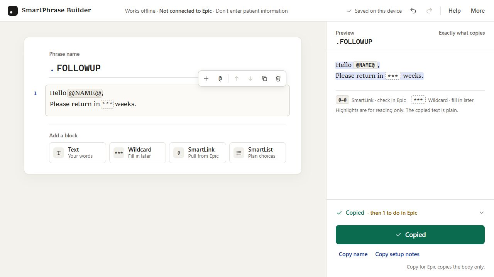
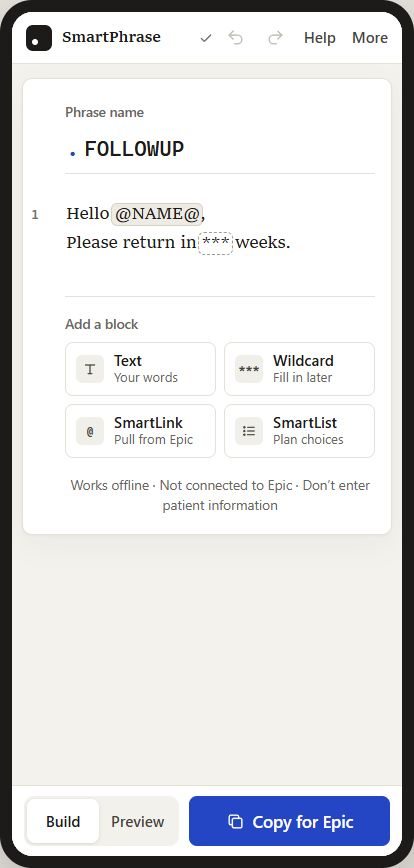

# SmartPhrase Builder

Build an Epic SmartPhrase one block at a time. The app works offline, keeps work in the browser, and produces plain text to paste into Epic.



## Project status

**Functional offline prototype.** The builder supports the complete local drafting flow described below. It is not connected to Epic, has not been clinically validated, and is not represented as a production deployment. Organization-specific phrases, reference banks, and patient data are intentionally excluded from this public repository.

## Problem and intended user

SmartPhrase authors often have to compose text, wildcards, SmartLinks, and SmartLists while keeping local naming and validation rules in mind. This prototype gives clinicians and documentation-workflow builders a visual place to assemble and review a draft before moving it into an approved Epic training or test environment.

## Start in one minute

1. Download or clone this project.
2. Open `index.html` in a modern browser.
3. Name the phrase.
4. Add text, SmartLinks, wildcards, or a SmartList plan.
5. Select **Copy for Epic**.
6. Paste into SmartPhrase Manager and test it in an approved Epic training or test area.

There is no install, account, server, analytics, or outside package.

## For clinicians

### What it does

- Shows the phrase as you build it.
- Lets you type `@` inside a sentence to find a SmartLink.
- Marks SmartLinks and SmartLists that need to be checked in Epic.
- Saves the draft in this browser.
- Copies plain text for Epic.

### What it does not do

- It does not connect to Epic.
- It does not create, publish, approve, or clinically validate a SmartPhrase.
- It cannot prove that a SmartLink exists in your organization.
- It must not contain patient information.

### Simple example

Build this:

```text
Name: FOLLOWUP

Hello @NAME@,
Please return in *** weeks.
```

The copied result is:

```text
Hello @NAME@,
Please return in *** weeks.
```

The builder reminds you to check `@NAME@` in Epic and fill in `***` while documenting.

See the ready-to-open [follow-up example](examples/follow-up-draft.json) and [SmartList-plan example](examples/smartlist-plan-draft.json).

## For recruiters and product teams

This project demonstrates product simplification in a safety-sensitive workflow:

- A dense three-column tool became one document-centered task: **name it, build it, copy it**.
- Progressive disclosure keeps file tools and reference libraries out of the main path.
- Blue identifies the one main action; amber means check in Epic; red means unfinished; green confirms a completed action.
- The same interaction works with pointer, keyboard, or touch.
- The release stays portable as one offline HTML file while the editable source remains modular.
- Safety language is visible without dominating the screen.



The design and engineering decisions are recorded in the [improvement plan](IMPROVEMENT_PLAN.md) and [current variable matrix](docs/VARIABLE_MATRIX.md).

### My contribution

I defined the product boundary, interaction model, drafting workflow, safety language, local data model, and implementation. The project translates experience with Epic documentation workflows into a public, generic prototype without exposing organizational content or patient information.

## For technical readers

### Architecture

`index.html` is a generated release artifact. Do not maintain it by hand.

```text
src/index.template.html       page structure and dialogs
src/styles/                  design tokens, layout, components, responsive rules
src/js/core.js               shared output rules and import validation
src/js/app/                  focused browser modules, ordered by filename
scripts/build.mjs            deterministic one-file build
test/                        Node tests with no outside test framework
examples/                    safe generic draft files
index.html                   generated offline release
```

The browser and tests use the same shared core. Application modules are kept below 260 lines by a test guard. Search for `* Future work:` to find human-readable handoff notes in the source.

### Commands

Node 18 or newer is enough. No dependency install is required.

```bash
npm run build
npm test
npm run check
```

`npm run check` rebuilds the release, runs all tests, and proves that `index.html` matches the modular source.

### Compatibility and storage

- Draft schema: `epic-smartobject-builder`
- Schema version: `1`
- Browser key: `epic-smartobject-builder.v1`
- Current version regenerates safe internal block IDs when a saved draft is loaded.
- Draft files are capped at 2 MB and 500 blocks.
- Reference libraries are capped at 5 MB and 10,000 entries.
- The app contains no runtime network request code.

See the [variable matrix](docs/VARIABLE_MATRIX.md) for colors, type, breakpoints, schema fields, limits, and status language.

## Optional local library

Use **More → Add your library** to load a local JSON reference file. It can contain `smartPhraseBank`, `smartObjectBank`, or both. The file stays in the browser and is not uploaded.

This is an advanced feature. The normal build-and-copy flow does not need it.

## Safety

- Never enter patient information.
- Confirm every SmartLink and SmartList in your own Epic setup.
- Test every phrase in an approved training or test area before clinical use.
- This independent project is not made, approved, or supported by Epic Systems Corporation.

Epic, SmartPhrase, SmartLink, SmartList, and SmartObject are names used only to describe compatibility with Epic software.

## Known limitations

- Epic configuration and available SmartTools vary by organization.
- The public project does not include an organization-specific catalog or clinical content.
- Draft checks cannot establish that a phrase is clinically appropriate or configured correctly in Epic.
- Automated tests cover the shared output rules, import boundaries, generated release, and modularity. Cross-browser, screen-reader, and clinical-workflow review still require people and approved test environments.

## Project history

This public project was distilled from a specialty-workbook prototype. Private source banks and patient data are not included.

Built by [Paul Peck](https://ppeck.me).

## License

[MIT](LICENSE)
